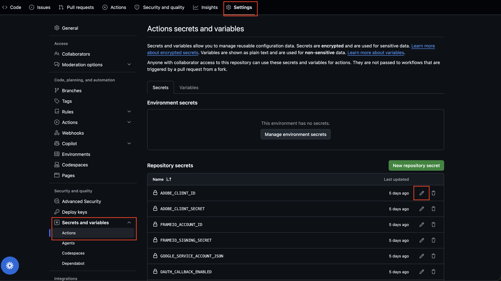
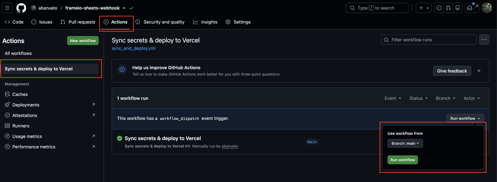

# Frame.io → Google Sheets Webhook

Automatically syncs Frame.io asset activity to a Google Sheet. When a new file is uploaded it appears as a new row. When metadata fields on an existing asset change, the corresponding row is updated in place.

---

## Table of Contents

1. [How It Works](#how-it-works)
2. [Configuration (`config.json`)](#configuration-configjson)
3. [Syncing Secrets & Deploying](#syncing-secrets--deploying)
   - [Where the secrets live](#where-the-secrets-live)
   - [Run the sync & deploy job](#run-the-sync--deploy-job)
   - [Which secret to change for common scenarios](#which-secret-to-change-for-common-scenarios)
4. [Environment Variables](#environment-variables)
5. [Sheet Structure](#sheet-structure)

---

## How It Works

```
Frame.io event
      │
      ▼
POST /api/webhook          ← app.py verifies HMAC signature
      │
      └─► handle_event()       ← enrichment.py
               │
               ├─ Skips events not in ENRICHMENT_EVENTS list
               │   (file.created, file.ready, file.label.updated, file.versioned, metadata.value.updated)
               │
               ├─ Fetches full file data from Frame.io API (includes metadata fields)
               │
               ├─ Maps Frame.io metadata field names → sheet columns (config.json)
               │
               └─► upsert_record()   ← sheets_writer.py
                        │
                        ├─ Picks the tab whose name matches the asset's Frame.io project (case-insensitive)
                        ├─ Searches the tab for a matching Frame.io File ID
                        ├─ Found ──────────────────────────────► UPDATE row
                        └─ Not found ──────────────────────────► INSERT new row
```

Writes can be turned off entirely with `SHEETS_ENABLED=false` (e.g. for a dry run).

### New Asset Uploaded

When a file is uploaded to Frame.io a `file.created` or `file.ready` event fires. The webhook fetches the full file record and, if no row exists yet for that file ID, **creates a new row** in the matching tab with all available metadata.

### Metadata Field Changed

When someone edits a custom metadata field on an existing asset a `metadata.value.updated` event fires. The webhook fetches the updated file, locates the existing row by Frame.io File ID, and **updates only the changed cells**. Cells not managed by Frame.io are left untouched.

### Version Stacked (e.g. R1 → R2)

When an edit is version-stacked, Frame.io creates a **new file asset** (new File ID) and fires `file.versioned`. The webhook detects that the asset belongs to a version stack, looks up the stack's other versions, and finds the **existing row** keyed by any prior version's File ID. It then **updates that same row in place** — swapping in the new File ID and the new status — and collapses any duplicate prior-version rows into that one row. This row-collapse is the **only** case where the webhook ever removes a row; nothing else is deleted from the sheet.

---

## Configuration (`config.json`)

Which Frame.io fields go to which sheet columns lives in one file: **`config.json`**. You do not need to touch any Python. Edit it, commit, and redeploy.

If `config.json` is missing or has a typo, the app falls back to the built-in default and logs a message — it won't crash.

```json
{
  "field_mappings": {
    "Status": "Status",
    "PM": "PM",
    "SME": "SME",
    "Notes": "Notes",
    "MODULE": "Module",
    "ID": "ID"
  }
}
```

### `field_mappings` — the important one

This is where you add fields. Each line is:

```
"<Frame.io field name>": "<Google Sheet column header>"
```

- **Left** = the field name exactly as it appears in Frame.io (the metadata field's name).
- **Right** = the column header in your Google Sheet where that value should be written.

Matching ignores case and spaces on both sides, so `"MODULE": "Module"` works even if the sheet header is `module`.

**To add a new field to sync:** add one line, make sure a column with that header exists in your sheet tab, and redeploy. For example, to start syncing a Frame.io field called `Editor` into a `Editor` column:

```json
  "field_mappings": {
    "Status": "Status",
    "Editor": "Editor",     ← added
    ...
  }
```

**To stop syncing a field:** delete its line. **To send a field to a differently-named column:** change the right-hand side, e.g. `"Notes": "Producer Notes"`.

---

## Syncing Secrets & Deploying

All runtime secrets live in **GitHub Actions secrets**. A GitHub Actions workflow (`.github/workflows/sync_and_deploy.yml`) pushes them into Vercel's Production environment and redeploys. 

### 1. Edit secrets

Edit secrets at **[github.com/abanuelo/frameio-sheets-webhook/settings/secrets/actions](https://github.com/abanuelo/frameio-sheets-webhook/settings/secrets/actions)** → **Repository secrets**. Click a secret's pencil icon to update its value (values are write-only — you replace, you can't read them back).



### 2. Sync secrets

The job is manual (`workflow_dispatch`). Go to the repo's **Actions** tab → **Sync secrets & deploy to Vercel** → **Run workflow**: [https://github.com/abanuelo/frameio-sheets-webhook/settings/secrets/actions](https://github.com/abanuelo/frameio-sheets-webhook/settings/secrets/actions).



Watch the run to completion — the health-check step fails the run if the deploy didn't come up.

### Which secret to change for common scenarios?

Update the secret(s) in GitHub, then run the workflow to push them to Vercel and redeploy.

| You want to… | Edit these secret(s) | Also do |
|---|---|---|
| Switch to a **new Frame.io workspace** / **new webhook** | `FRAMEIO_SIGNING_SECRET` (shown once at webhook creation) and `FRAMEIO_ACCOUNT_ID` | Create the webhook in Frame.io pointing at your `/api/webhook` URL first (see [Setup Guide](#2-configure-the-frameio-webhook)) |
| Point at a **different Google Sheet** | `SHEET_ID` | Share the new sheet (**Editor**) with `frameio-sheets@soe-frameio-sheets.iam.gserviceaccount.com` — without this, every write returns a 403 |


---

## Environment Variables

### Frame.io / Adobe

| Variable | Where to get it | Notes |
|---|---|---|
| `FRAMEIO_SIGNING_SECRET` | Frame.io → Settings → Webhooks, shown once at webhook creation | Used to verify every inbound webhook payload |
| `FRAMEIO_ACCOUNT_ID` | Frame.io URL: `next.frame.io/?a=<this value>` | Required to call the Frame.io v4 API |
| `ADOBE_CLIENT_ID` | Adobe Developer Console → your project | OAuth app credentials |
| `ADOBE_CLIENT_SECRET` | Adobe Developer Console → your project | OAuth app credentials |
| `OAUTH_CALLBACK_ENABLED` | Set manually | `true` only during the one-time OAuth setup, then set to `false` |
| `KV_REST_API_URL` | Auto-injected by the Upstash Redis integration (see below) | Persists rotated refresh tokens across deploys |
| `KV_REST_API_TOKEN` | Auto-injected by the Upstash Redis integration | |
| `CRON_SECRET` | Set manually — any random string, 16+ chars | Authenticates the daily `/cron/refresh` keep-alive ping |

### Google Sheets

| Variable | Where to get it | Notes |
|---|---|---|
| `SHEET_ID` | Spreadsheet URL: `docs.google.com/spreadsheets/d/<SHEET_ID>/edit` | The target spreadsheet |
| `GOOGLE_SERVICE_ACCOUNT_JSON` | Google Cloud Console → service account → JSON key | Entire JSON file contents as a single value. The service account must be shared (Editor) on the spreadsheet |
| `SHEETS_ENABLED` | Set manually | Defaults to `true`. Set `false` to disable Sheets writes |

The target tab is **routed by Frame.io project name** — the writer matches the asset's project name against the tab titles in the spreadsheet (case-insensitively) and writes there. If no tab matches, the update is skipped and logged. Which fields land in which columns is controlled by [`config.json`](#configuration-configjson), not env vars.

> [!NOTE]
> **Token rotation is automatic.** When Adobe rotates the refresh token, the app persists the new one to Vercel KV (Upstash Redis) — no env var update or redeploy needed. A daily Vercel Cron job (`/cron/refresh`, see `vercel.json`) forces a refresh so the token never sits idle past Adobe's ~14-day expiry. 

---

## Sheet Structure

Each project tab has a header row (row 1). The default columns, all populated automatically by the webhook, are:

| Column | Frame.io Source |
|---|---|
| Name | Asset filename (fixed column) |
| File ID | Asset ID (fixed column) |
| SME | `SME` metadata field |
| PM | `PM` metadata field |
| Status | `Status` metadata field |
| Notes | `Notes` metadata field |
| Module | `MODULE` metadata field |
| ID | `ID` metadata field |

`Name` and `File ID` are always written and can't be reconfigured. The rest come from `field_mappings` — add, remove, or rename those columns by editing [`config.json`](#configuration-configjson).

The lookup key is **File ID** — every upsert first searches the File ID column for a row matching the Frame.io file ID before deciding whether to insert or update.

Column names are matched **case-insensitively** (spaces and underscores are ignored too), so a header named `Module`, `MODULE`, or `module` all map to the same field. Columns can appear in any order — they are located by header name, not position. Any configured column without a matching header is logged as a warning and skipped.
